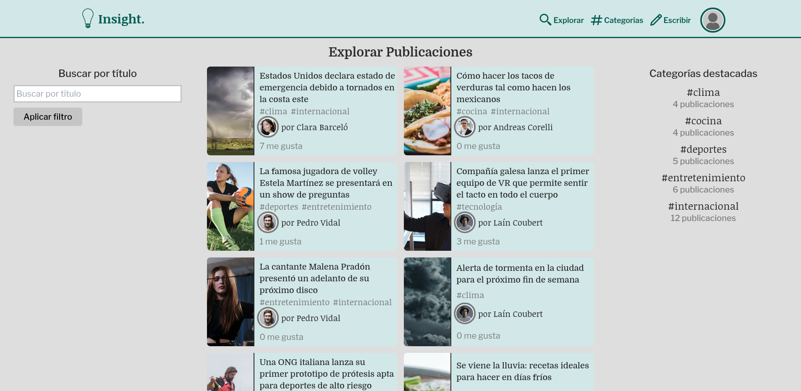

### *Project of an online news blog made with the Laravel framework*

### **Live demo: https://insight-noticias.herokuapp.com//**

 

### [README en español acá :argentina: :mexico:](README.md)

 

Insight is a full-stack applicaton for reading and writing blog posts, with many features such as user creation, file uploading, a reaction system supporting *likes*, comments, and saves, post tags, filtering and post editing.

Both *frontend* and *backend* were written with the PHP framework, [Laravel](https://laravel.com/docs/8.x) `v.8.81.0`, connected to a [MySQL](https://www.mysql.com/) database. The *frontend* also uses [TailwindCSS](https://tailwindcss.com/docs/) for applying CSS styles.

For the majority of the project I applied the TDD (*Test-Driven Development*) methodology, which implies writing the tests to pass before the code itself. These tests are available at `tests/Feature` and may be run using the artisan command: `php artisan test`.

Due to the [limitations from Heroku's free hosting](https://devcenter.heroku.com/articles/active-storage-on-heroku#ephemeral-disk) which don't allow the storage of files in the Dyno's disk, it's not possible to preserve user-uploaded images. My solution to this problem was seeding the database every time the Dyno is reboot (which occurs after an inactivity period) with `php artisan db:seed`. This way users can use all of the app's features as long as the Dyno is active.

 

# Contributing and License
This work is licensed under the [MIT License](https://choosealicense.com/licenses/mit/). **You are free to read, use or modify any part you want!**

Any contribution by submitting code, notifying bugs, suggestions or any other way is always greatly appreciated.

¡I hope you've liked my work! :+1:
